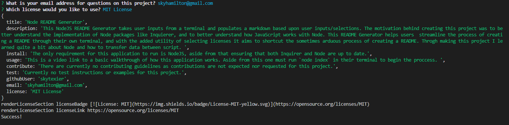

# Node README Generator 
          
# Description
  
This NodeJS README Generator takes user inputs from a terminal and populates a markdown based upon user inputs/selections. The motivation behind creating this project was to better understand the implementation of Node packages like Inquierer, and to better understand how JavaScript works with Node. This README Generator helps users streamline the process of creating a README through their own terminal, and with the added utility of selecting licenses it aims to shortcut the sometimes arduous process of creating a README. Throgh making this project I learned quite a bit about Node and how to transfer data between script. The biggest challenges I faced were with Node and understanding how to combine the two scripts into a finalized markdown. 
  
# Table of Contents
- [Installation](#installation)
- [Usage/Examples](#usage-and-video-example)
- [Contrubiting Guidelines](#contribution-guidelines)
- [Tests](#tests)
- [Questions](#questions)
- [License](#license)

# Installation
  
The only requirement for this application to run is NodeJS, aside from that ensuring that both Inquirer and Node are up to date.
  
# Usage and Video Example
  
This is a video link to a basic walkthrough of how this application works. Aside from this one must run `nodeindex` in their terminal to begin the proccess.
walkthrough.mp4
Here is a screenshot of what the terminal looked like in generating this README.

  
# Contribution Guidelines
  
There are currently no contributing guidelines as contributions are not expected nor requested for this project.
  
# Tests
  
Currently no test instructions or examples for this project.

# Questions

To see my Github page for further documentation, updates or other projects click [here](https://github.com/skytexier).

For further questions or inquaries reach out at skyhamilton@gmail.com

# License

https://opensource.org/licenses/MIT

MIT License

Copyright (c) 2022 Sky Texier

Permission is hereby granted, free of charge, to any person obtaining a copy
of this software and associated documentation files (the "Software"), to deal
in the Software without restriction, including without limitation the rights
to use, copy, modify, merge, publish, distribute, sublicense, and/or sell
copies of the Software, and to permit persons to whom the Software is
furnished to do so, subject to the following conditions:

The above copyright notice and this permission notice shall be included in all
copies or substantial portions of the Software.

THE SOFTWARE IS PROVIDED "AS IS", WITHOUT WARRANTY OF ANY KIND, EXPRESS OR
IMPLIED, INCLUDING BUT NOT LIMITED TO THE WARRANTIES OF MERCHANTABILITY,
FITNESS FOR A PARTICULAR PURPOSE AND NONINFRINGEMENT. IN NO EVENT SHALL THE
AUTHORS OR COPYRIGHT HOLDERS BE LIABLE FOR ANY CLAIM, DAMAGES OR OTHER
LIABILITY, WHETHER IN AN ACTION OF CONTRACT, TORT OR OTHERWISE, ARISING FROM,
OUT OF OR IN CONNECTION WITH THE SOFTWARE OR THE USE OR OTHER DEALINGS IN THE
SOFTWARE.
 
